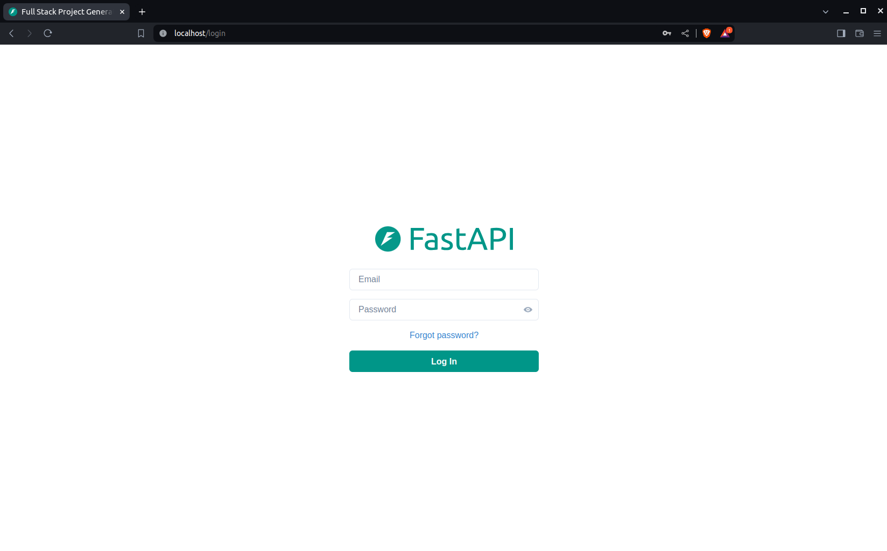

### Dashboard Login

### Dashboard - Admin

### Dashboard - Create User

### Dashboard - Items

### Dashboard - User Settings

### Dashboard - Dark Mode

## Backend Development

Backend docs: [backend/README.md](./backend/README.md).

## Frontend Development

Frontend docs: [frontend/README.md](./frontend/README.md).

## Deployment

Deployment docs: [deployment.md](./deployment.md).

## Development

General development docs: [development.md](./development.md).

This includes using Docker Compose, custom local domains, `.env` configurations, etc.

## Release Notes

Check the file [release-notes.md](./release-notes.md).

## License

The Full Stack FastAPI Template is licensed under the terms of the MIT license.
